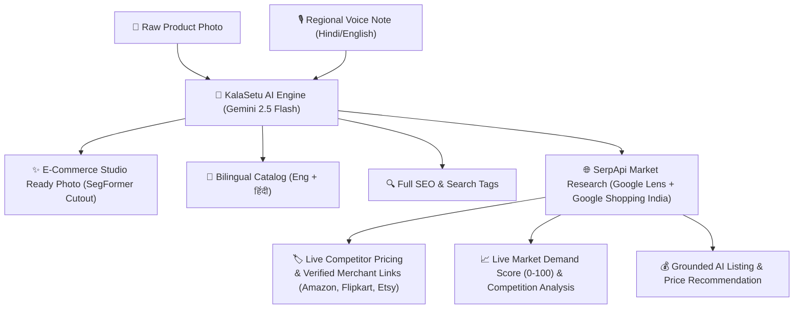
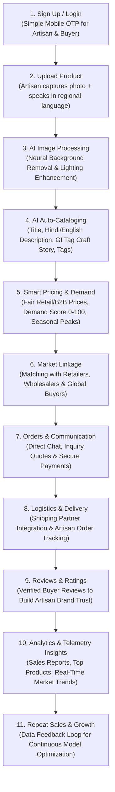

# KalaSetu (Artisan-AI) 🏺
### AI-Driven Market Linkage and Smart Cataloging Mobile Application for Marginalized Artisans

[](https://sih.gov.in)
[](#)
[](#)
[](#)
[](#)

---

## 📌 Project Overview & Hackathon Metadata

| Field | Details |
| :--- | :--- |
| **Problem Statement Title** | **AI-Driven Market Linkage and Smart Cataloging Mobile Application for Marginalized Artisans** |
| **Theme** | **HERITAGE AND CULTURE** |
| **PS Category** | **Software** |
| **Problem Statement ID** | **SIH26090 (Ministry of Social Justice & Empowerment)** |
| **Team Name** | **NextGen Builder's** |
| **Solution Name** | **KalaSetu (कला सेतु) — Empowering Rural & Marginalized Indian Artisans** |

---

## 🔍 The Problem We Are Solving

India is home to over **6.4 million traditional artisans and craftspersons**, yet the majority remain economically vulnerable due to systemic digital barriers:

1. **Digital Literacy & Language Gap**:
   - Rural and home-based craftspeople lack the technical skills to fill complex multi-step e-commerce seller registration forms in English.
2. **Cataloging & Photography Barrier**:
   - Professional studio photography, background isolation, commercial product copywriting, SEO optimization, and keyword tagging are difficult, expensive, and time-consuming.
3. **Severe Pricing Disadvantage & Middleman Exploitation**:
   - Without direct visibility into national market demand and raw material/labor cost benchmarks, artisans under-price their work and lose up to 70% of potential margins to middlemen.
4. **Fragmented B2B Market Access**:
   - Artisans struggle to connect with bulk buyers, corporate gifting agencies, exporters, and boutique retailers.

---

## 💡 Proposed Solution & Unique Value Proposition (UVP)

**KalaSetu** is an all-in-one, voice-first, AI-driven mobile/web application that transforms raw handmade craft products into complete e-commerce listings with fair pricing and market linkage in **under 30 seconds**.

### 🌟 Core Innovation: *Photo + Voice ➔ AI-Generated Catalog, Pricing, SEO, & Demand*



### ✨ How Our Solution Stands Out Against Existing Platforms

| Feature | Existing Platforms (e.g., Indiahandmade) | **KalaSetu (Our Solution)** |
| :--- | :--- | :--- |
| **Product Onboarding** | Manual, tedious form-filling (30+ minutes per item) | **1 Photo + 1 Voice Note in Hindi/Regional language** |
| **Photography** | Seller must upload pre-edited white-background images | **AI Background Removal & Studio Isolation (SegFormer / remove.bg)** |
| **Copywriting & SEO** | Manual English copywriting required | **Automated Gemini Vision + NLP Catalog & SEO Generation** |
| **Bilingual Translation** | English only | **Native Bilingual Hindi & English with craft storytelling** |
| **Pricing Strategy** | Seller guesses price; risk of under-pricing | **Smart Fair Pricing Engine + Live Market Competitor Benchmarking** |
| **Market Intelligence** | Static listings; no visibility into demand | **Live SerpApi Google Shopping & Google Lens Competitor Discovery + 0-100 Demand Score** |
| **B2B Linkage** | Retail-focused, no bulk quote negotiation | **Integrated B2B Quote Inquiries & Bulk Wholesale Matching** |

---

## ⚙️ Technical Approach & System Architecture

### 1. Applications & Core Services
- **Mobile/Web Frontend**: React 19, TypeScript, Tailwind CSS, Lucide Icons, Framer Motion, fully mobile-responsive with voice-first UI.
- **Backend API Server**: Node.js & Express.js (RESTful APIs, asynchronous AI pipeline orchestration, secure rate-limiting).
- **Market Research & Search Intelligence (SerpApi)**:
  - **Google Lens Products API**: Visual similarity search identifying matching craft products and aesthetic equivalents.
  - **Google Shopping API**: India-localized marketplace discovery (`gl=in, hl=en, location=India`) extracting live merchant prices, ratings, review counts, and verified source links (Amazon.in, Flipkart, Etsy, TheHandicraftian).
  - **Google Web Organic Search**: Market density and buyer search query signals.
  - **Deduplication & Ranking Engine**: Normalizes merchant URLs, removes duplicates, and ranks top 8 competitors using artisan craft/material weighted scoring.
  - **Demand Predictor Service**: Configurable 7-factor weighted scoring model (Market Visibility 20%, Price Competitiveness 20%, Ratings/Reviews 15%, Search Signals 15%, Competition 15%, Craft Differentiation 10%, Seasonality 5%).
- **AI & ML Pipeline**:
  - **Vision & Multimodal Recognition**: Google Gemini 2.5 Flash (`@google/genai`) identifying craft type, raw materials, colors, and artisan techniques directly from photographs.
  - **Voice Transcription & Intent**: Hugging Face Whisper (`openai/whisper-large-v3-turbo`) + Web Speech API for Hindi and regional voice processing.
  - **Neural Background Removal**: Hugging Face SegFormer (`nvidia/segformer-b0-finetuned-ade-512-512`) and Remove.bg API for instant studio cutout.
  - **Anti-Hallucination Listing Generator**: Synthesizes market-grounded listing titles, descriptions, SEO tags, and recommended prices strictly adhering to observed market data.
- **Database & Storage**: PostgreSQL via Supabase with client-side in-memory persistence fallback for offline reliability.

---

## 🔄 End-to-End 11-Stage Workflow



---

## 🎯 Target Users

1. **Marginalized Rural & Home-Based Artisans**: Individual craftspeople, women self-help groups (SHGs), and generational artisan families.
2. **Traditional Craft Communities**: Potters (Khurja/Terracotta), Weavers (Banarasi/Chanderi), Brass artisans (Moradabad), Folk painters (Madhubani/Warli/Pattachitra), Woodworkers (Saharanpur).
3. **Micro-Entrepreneurs & Co-operatives**: Small handicraft units and GI-tagged cluster societies.
4. **B2B Buyers & Institutions**: Corporate gifting managers, interior designers, export houses, and boutique retailers seeking verified authentic artisan products.

---

## 🏆 Key Benefits & Impact (BENIFITS)

### 1. AI Smart Cataloging (कम समय में प्रोफेशनल कैटलॉगिंग)
- Eliminates manual typing and data-entry errors.
- Generates high-converting titles, descriptions, and metadata from a single photograph.

### 2. Better Market Reach (स्थानीय से राष्ट्रीय बाज़ार तक पहुँच)
- Broadens artisan reach from local weekly haats to national B2B wholesale buyers, export aggregators, and conscious consumers.

### 3. Smart Pricing Assistance (सही कीमत तय करने में सहायता)
- Real-time cost-plus and market-based pricing suggestions prevent exploitation and protect artisan margins.

### 4. Market Demand Insights (मार्केट की जानकारी प्राप्त करें)
- 30/60/90-day predictive scores and upcoming festival spikes (Diwali, Wedding Season, Durga Puja) help artisans plan production and inventory.

### 5. Advanced Customer Understanding (ग्राहक की बेहतर समझ)
- Analytics dashboard tracks customer engagement, search queries, cart additions, and regional preferences.

### 6. Empowerment & Inclusion (कारीगरों को डिजिटल रूप से सशक्त बनाना)
- Bridges the digital divide with full Hindi language support, voice-first commands, and mobile-friendly layouts.

### 📈 Chain of Value Creation
$$\text{Less Digital Effort} \longrightarrow \text{More Product Listings} \longrightarrow \text{Wider Market Access} \longrightarrow \text{Better Price Awareness} \longrightarrow \mathbf{More\ Income\ Opportunities}$$

---

## 💻 Tech Stack Overview

- **Frontend**: React 19, TypeScript, Tailwind CSS, Lucide React, Motion.
- **Backend**: Node.js, Express.js.
- **AI & Market Intelligence Services**:
  - Google Gemini 2.5 Flash Multimodal Vision & NLP (`@google/genai`)
  - SerpApi Engine (`google_shopping`, `google_lens`, `google` with India localization)
  - Hugging Face SegFormer & Whisper Large v3
  - Remove.bg API
- **Database**: Supabase PostgreSQL + Local Storage Fallback Cache.
- **Tooling**: Vite 6, tsx, esbuild.

---

## 🚀 Quickstart & Setup for Evaluation

### 1. Clone & Install Dependencies
```bash
git clone https://github.com/your-username/Artisan-Ai.git
cd Artisan-Ai
npm install
```

### 2. Configure Environment Variables
Copy `.env.example` to `.env`:
```bash
cp .env.example .env
```
Add your API Keys in `.env` (Never exposed client-side; securely managed on server):
```env
# Google Gemini API Key
GEMINI_API_KEY="YOUR_GEMINI_API_KEY"

# SerpApi Key for Google Lens & Google Shopping Market Research
SERPAPI_KEY="YOUR_SERPAPI_KEY"
```
*(Note: You can also enter or test the Gemini API Key directly inside the app UI via the top navigation bar).*

### 3. Start Development Server
```bash
npm run dev
```
The server will start on: **`http://localhost:3000`**

### 4. Build for Production
```bash
npm run build
npm start
```

---

## 📋 Evaluation Checklist for Judges

- [x] **Voice-to-Intent**: Speak or test sample Hindi/English voice notes to capture product craft details.
- [x] **One-Photo Gemini Vision Scanning**: Upload any craft image (Madhubani painting, terracotta diya, silk saree, brass lamp) and watch AI extract materials, technique, and craft identity.
- [x] **Automated 5-in-1 Output**:
  - [x] Title & Description (English & Hindi)
  - [x] Craft Story & GI Heritage Details
  - [x] Comprehensive E-Commerce SEO, Slug & Keywords
  - [x] Fair Pricing with Labor & Material Cost Breakdowns
  - [x] Market Demand Score & Festive Seasonality Insights
- [x] **Live SerpApi Market Intelligence & Competitor Discovery**:
  - [x] Real-time Google Shopping India discovery across verified merchants (Amazon.in, Flipkart, Etsy, TheHandicraftian).
  - [x] Google Lens visual product candidate matching.
  - [x] Live competitor price range (Min, Max, Median) and review counts.
  - [x] Verified, direct merchant URLs with clickable `[View Source]` links.
- [x] **Market Signal-Based Demand Model**: Configurable 7-factor weighted scoring model (0-100 Score, Level, Trend, Confidence).
- [x] **Anti-Hallucination AI Listing & Price Advisor**: Generates market-grounded listing titles, descriptions, tags, and fair pricing without inventing certifications or guaranteed sales numbers.
- [x] **AI Background Isolation**: One-tap background cutout for e-commerce catalog ready photography (SegFormer & Remove.bg).
- [x] **B2B Wholesale Inquiries**: Request custom quotations with bulk quantity discounts.

---

## 👥 Team NextGen Builder's
*Built with pride for the Smart India Hackathon 2026 (SIH26090 — Ministry of Social Justice & Empowerment).*